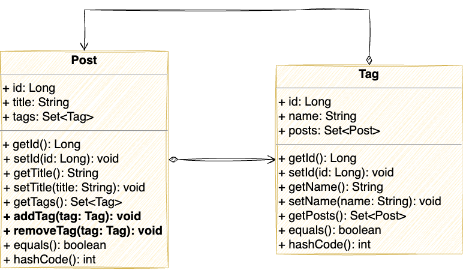

# Synchronization Methods for Many-To-Many Associations

## 1. Many-To-Many Bidirectional Associations: Why to Synchronize?
To start speaking about sync methods, we need to say a few words about bidirectional associations. Let’s assume that we’re creating a blog application and want to mark every post with several tags. For this application, we make two JPA entities: `Post` and `Tag` with appropriate attributes like ID, text, etc. Now we need to establish the association between one post and many tags. We can define a `tags` attribute on the `Post` entity, the type of this attribute will be `Set<Tag>`. We can notice that each tag can be reused for more than one post. In this case, we can create the `posts` attribute of type `Set<Post>` in the `Tag` entity. This is the bidirectional many-to-many association: we have references to several entities on both sides of the association. And now, our data model looks like this:



The code for entities from the example above:
```java
@Entity
@Table(name = "post")
public class Post implements Serializable {

    @Id
    @Column(name = "id", nullable = false)
    private Long id;

    @Column(name = "title")
    private String title;

    @ManyToMany
    @JoinTable(name = "post_tag",
            joinColumns = @JoinColumn(name = "post_id", referencedColumnName = "id"),
            inverseJoinColumns = @JoinColumn(name = "tag_id", referencedColumnName = "id"))
    private Set<Tag> tags = new HashSet<>();

    //Setters, getters, and constructors are omitted
}

@Entity
@Table(name = "tag")
public class Tag implements Serializable {

    @Id
    @Column(name = "id", nullable = false)
    private Long id;

    @Column(name = "name")
    private String name;

    @ManyToMany(mappedBy = "tags")
    private Set<Post> posts = new HashSet<>();

    //Setters, getters, and constructors are omitted
}
```
Bidirectional associations are convenient. They simplify entity traversing; we can fetch entities from any side: find a post and then get its tags or vice versa. In addition to that, lazy fetching helps us to avoid performance problems.

When implementing many-to-many bi-directional associations in JPA, we must define an “owning side”. To mark an entity as the “owning side”, we should mark its `@ManyToMany` collection with the `@JoinTable` annotation. It means that Hibernate will track changes in this collection and update the junction table in the database accordingly.  

Before selecting an entity to “own” the association, we should consider data usage. For our application, we can assume that users will search for posts and create and update them more often than tags. Therefore, setting the `Post` entity as the “owning side” makes more sense. So, if we look at the `Post` entity code above, we’ll see that the `tags` collection is annotated with `@JoinTable`. This is precisely what we need.

One more thing that we need to remember is that we need to keep the bidirectional association synchronized. E.g., when we add a `Tag` instance to a `tags` set in a `Post`, we should not forget to add this `Post` to the corresponding `posts` set in the `Tag` entity. The same logic applies to the `Tag` removal process. To implement this approach, we add synchronization methods to both entities. For the sake of simplicity, only methods for the `Post` entity are provided; for the `Tag`, they will be pretty the same.

```java
public void addTag(Tag tag) {
    tags.add(tag);
    tag.getPosts().add(this);
}

public void removeTag(Tag tag) {
    tags.remove(tag);
    tag.getPosts().remove(this);
}
``` 
Note that the junction table in the database will be updated only if we update the “owning” side collection. For example, if we add a tag instance into the `tags` collection in the `Post` entity without the sync method and save the post, the association will be updated. The `posts` collection update in the `Tag` entity update won’t work if we don’t update `tags` in the `Post`. So, synchronization methods are essential for the “non-owning” side.

It wasn’t too hard to remember and implement, was it?

We used an example from Vlad Mihalcea’s [article on synchronized methods]( https://vladmihalcea.com/jpa-hibernate-synchronize-bidirectional-entity-associations/). You can find very detailed reasoning and explanation of the implementation of these methods in the article. It is very useful, but there are some edge cases that we will review in the following sections.
## 2.	What Сan Go Wrong?

In the previous section, we have defined bidirectional references and methods that synchronize data changes in both entities; they look fine and should work fine. Where is the problem?

### 2.1. Unexpected LazyInitException
Let’s assume that we need to remove a tag from a post. To implement this, we need to do the following:
1. Fetch the post with its tags from the database.
2. Find a required tag in the post tags list.
3. Remove a tag from the post.
4. Save the post to the database.

To save one extra query, we will fetch a post with its tags collection from the database. To do that, we will define an entity graph and specify the `tags` collection in the attributes list. The JPA Repository method will use this graph to create a derived query for searching for a post by ID.

```java
public interface PostRepository extends JpaRepository<Post, Long> {
    @EntityGraph(attributePaths="tags")
    Optional<Post> findPostWithTagsById(Long id);
}
```

And now, we can implement and test the tag removal.

```java
@Test
void testRemoveTagFromPost() {
    Post post = postRepository.findPostWithTagsById(1L).orElseThrow();
    Tag tag = post.getTags().stream()
            .filter(t -> t.getId() == 1L)
            .findFirst().orElseThrow();
    post.removeTag(tag);
    postRepository.save(post);

    Collection<Tag> tags = postRepository.findPostWithTagsById(1L).orElseThrow().getTags();
    Optional<Tag> deletedTag = tags.stream()
            .filter(t -> t.getId() == 1L)
            .findFirst();

    assertTrue(deletedTag.isEmpty(), "The tag should be deleted");
}
```

This code will throw `LazyInitException` in the non-transactional context. If we dig deeper, we’ll see that we get this exception when trying to remove the post reference from the tag in the collection synchronization method.
This exception is also thrown if we try to add a tag to the post:

```java
@Test
void testAddTagToPost() {
    Post post = postRepository.findPostWithTagsById(1L).orElseThrow();
    Tag tag = tagRepository.findById(3L).orElseThrow();
    post.addTag(tag);
    postRepository.save(post);

    Collection<Tag> tags = postRepository.findPostWithTagsById(1L).orElseThrow().getTags();
    Optional<Tag> addedTag = tags.stream()
            .filter(t -> t.getId() == 3L)
            .findFirst();

    assertTrue(addedTag.isPresent(), "The tag should be added");
}
```
But why is it happening?

The association `@ManyToMany` is lazy by default, so the `posts` collection in each `Tag` instance remains unpopulated after we fetch tags along with the post. It is proper behavior from the performance point of view (we don’t need all post references for every tag). Still, we should be careful while accessing collection on the “other” end of an association: `posts` in `Tag` in our case.

How can we avoid it? Probably the most reliable way is to update synchronization methods and check whether a collection is initialized to avoid the exception. So, the updated method might look like this:

```java
public void removeTag(Tag tag) {
    tags.remove(tag);
    if (Hibernate.isInitialized(tag.getPosts())){
        tag.getPosts().remove(this);
    }
}
```

Hibernate will perform a proper database update even if the `posts` collection in the `Tag` entity is not initialized because we change a collection on the “owning side”, i.e., in the `Post` entity. Therefore, all links will be appropriately updated in the database.

In conclusion: be careful with bi-directional synchronization methods in a non-transactional context, and check whether collections for associated entities are initialized. Always initialize and update the association collection on the “owning side”.

### 2.2. Too Many Queries
OK, we have reviewed the issues when we use detached entities. Now let’s look at the queries generated by the bidirectional associations and synchronized methods in the transactional context.
For example, we will add an existing tag to an existing post. To do this, we need to:
1. Find a post
2. Find a tag
3. Add the tag to the post
4. Save the post with the tag

You can see the code that implements and tests this algorithm below. Please note that the method is annotated with `@Transactional`, so we won’t need to save the post explicitly and care about lazy fetching.

```java
@Transactional
void addTagToPost(Long postId, Long tagId) {
    Post post = postRepository.findPostWithTagsById(postId).orElseThrow();
    Tag tag = tagRepository.findById(tagId).orElseThrow();
    post.addTag(tag);
}
```
If we run this method, we’ll see the following SQL queries:
```sql
-- postRepository.findPostWithTagsById(postId)
select post.id as id, post.title as title 
from post post 
left outer join post_tag on post.id= post_tag.post_id 
left outer join tag on post_tag.tag_id=tag.id
where post.id=?
-- tagRepository.findById(tagId)
select tag.id as id, tag.name as name from tag  where tag.id=?
-- Now we have synchronization methods running
select post_tag.tags_id as tags_id, post_tag.post_id as post_id, post.id as id, post.title as title 
from post_tag 
inner join post on post_tag.post_id= post.id 
where post_tag.tags_id=?
-- committing data
insert  into post_tag (post_id, tag_id) values (?, ?)
```
Why do we need the `select` that queries the `posts` table and fetches all posts for a particular tag? Let’s have a look at the synchronization method again:
```java
public void addTag(Tag tag) {
    tags.add(tag);
    tag.getPosts().add(this);
}
```
The `tag.getPosts().add(this)` statement needs to initialize the `posts` collection in the `Tag` entity because this is lazily fetched and not initialized initially. Fair enough.
Can we avoid extra work for this case? Yes and no. Let’s change the `posts` collection datatype in the `Tag` class from `Set` to `List`.
```java
@Entity
@Table(name = "tag")
public class Tag implements Serializable {

    //Entity code is omitted

    @ManyToMany(mappedBy = "tags")
    private List<Post> posts = new ArrayList<>();

}
```
After that, let’s add a tag to a post tags list and save the data. Now we can see the following SQL:
```sql
select post.id as id, post.title as title 
from post post 
left outer join post_tag on post.id= post_tag.post_id 
left outer join tag on post_tag.tag_id=tag.id
where post.id=?

select tag.id as id, tag.name as name from tag  where tag.id=?

insert  into post_tags (post_id, tags_id) values (?, ?)
```
As we can see, changing the collection on the “non-owning” side from `Set` to `List` helps. Why is it happening? Hibernate uses `PersistenceBag` implementation for `List` collection in entities. This implementation is internally optimized for handling operations on non-uninitialized collections. So, when we add a `Post` reference to a `Tag`, Hibernate appends the `add` operation into the internal operations queue in the `PersistentBag` and will be executed later during commit. Does it mean that `List` is a preferable collection type for both ends of the association?

Let’s try this for the “owning side”: change `tags` in the `Post` collection type to `List` too.
```java
@Entity
@Table(name = "post")
public class Post implements Serializable {

    //Entity code is omitted

    @ManyToMany
    @JoinTable(name = "post_tag",
            joinColumns = @JoinColumn(name = "post_id", referencedColumnName = "id"),
            inverseJoinColumns = @JoinColumn(name = "tag_id", referencedColumnName = "id"))
    private List<Tag> tags = new ArrayList<>();

}
```
What will we see in the log? Select queries are just the same, but the last few operators will look like the following:
```sql
delete from post_tags where post_id=?
insert  into post_tags (post_id, tags_id) values (?, ?)
```
Hibernate repeats the last `insert` statement as many times as we have tags for the post. Basically, we recreate all links between the post and its tags, which is inefficient. We insert most of the data again and initiate DB indexes rebuild for the junction table.

So, using a `List` in the “owning side” entity for many-to-many associations is generally a bad idea. It causes full links recreation.

## 3.	Conclusion
Bidirectional associations are convenient, and synchronization methods prevent data inconsistency. But those methods may cause some issues in edge cases. We can get `LazyInitException`, extra queries, or inefficient data update queries. So, if we need to implement a bidirectional association with synchronization methods, there are some tips:

1. In the synchronization methods, consider usage in a non-transactional context. Use `Hibernate.isInitialized ` to check if a collection on the other side is initialized.
2. Prefer `Set` collection type to define a many-to-many association – Hibernate generates better SQL for data update. Remember that synchronization methods cause collections initialization for both sides in the association.
3. Consider using `List` instead of `Set` collection type in the many-to-many association on the “non-owning” association side to save an extra select query.
4. Remember that using `List` as a collection type on the “owning” side in many-to-many associations causes complete links recreation in the junction table.
5. Synchronization methods for the “owning” side entity are optional, but we’d recommend implementing them for the “non-owning” side with all precautions listed above.


You can find the initial code and complete test suite [here](https://github.com/belyaev-andrey/m2m-syncronized-methods).
The final version with all fixes is [here](https://github.com/belyaev-andrey/m2m-syncronized-methods/tree/fixed-associations). 